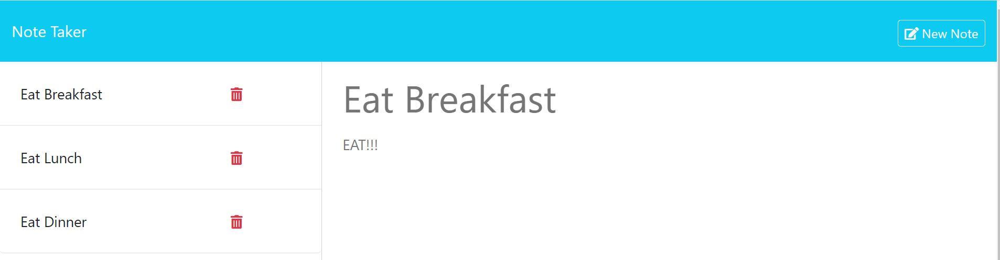

# Note Taker Application

## Description

This project allows the user to enter notes into a webpage and save them to a file.  The previously saved notes are displayed on the screen.  The user can also delete the notes.  My motivation for building this project was to gain experience with both writing the back end of an application and also learning how to deal with server-side routes.  I built this project so that I could start learning both how to use Express.js, and also how to deal with GET, POST, and DELETE requests.  This project solves the problem of an everyday person needing to have a way to keep track of tasks that need to be done during the day.  In this project, I began learning about Express.js and I learned how to write server-side routes.  I also learned a bit more about debugging promises with this application.

## Table of Contents (Optional)

This README isn't that long, so N/A.

## Installation

N/A 

## Usage

Here is a screenshot of what the Note Taker Application looks like: 

To use this application, please navigate to the following link: .  Next, click the blue **Get Started** button in the center of the screen.  This will take you to the note taker application.  Any previously saved notes will appear at the left side of the screen.  If you wish to see the saved text in a note, rather than just the title, click on the note.  To enter a new note, enter a tile and text on the right side of the screen.  If you have already clicked on an existing note, click **New Note** in the upper-right corner of the screen, and then you will be able to enter a new note.  Once you have entered the note's title and text, you can save the note by clicking **Save Note** in the upper-right portion of the screen.  If, while entering a note, you wish to clear out the text you have entered, you can click the **Clear Form** button in the upper-right corner of the screen.  Once you have clicked the **Save Note** button, the note you entered will appear in the list of notes on the right side of the screen.

If you wish to delete a saved note, click the trash can icon located to the right of it.  If there are no saved notes, the application will print the text "No Saved Notes" in the space where the saved notes usually are.

## Credits

A certain amount of the code and syntax for a server-side portion of an application is boilerplate.  To get the boilerplate code working properly, I used boilerplate code from the activities for module 11.  I used this code in server.js and /routes/notes.js.  Additionally, the routes in server.js look very similar to the code in server.js of activity 21 of module 11.  I used code from that activity to make my code work.

Additionally, I used code from activity 21 of module 11 to allow me to modularize the routes for this app.  I used this code in /routes/index.js. and routes/notes.js

I used the NPM UUID package to generate UUIDs for the notes.  I took the code to use it from this page [https://dev.to/gulshanaggarwal/npm-packages-to-generate-unique-ids-for-your-next-project-1p3b](https://dev.to/gulshanaggarwal/npm-packages-to-generate-unique-ids-for-your-next-project-1p3b).  This page was written by Gulshan Aggarwal.  Here is a link to his profile page on dev.to: [https://dev.to/gulshanaggarwal](https://dev.to/gulshanaggarwal).

## License

This project is under an MIT license.  Please see the license in the GitHub repository for more information.

## Badges

I don't have any noteworthy badges to display.

## Features

This project is an application for taking notes.  It allows the user to enter notes, save them, display them, and then delete them if desired.

## How to Contribute

This was a project I personally completed, so N/A.

## Tests

N/A